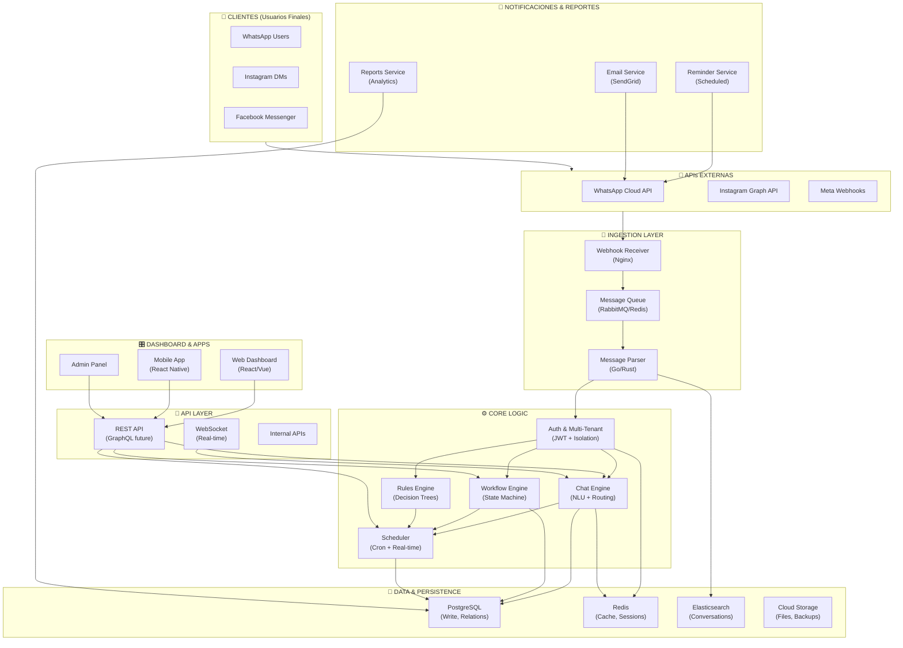
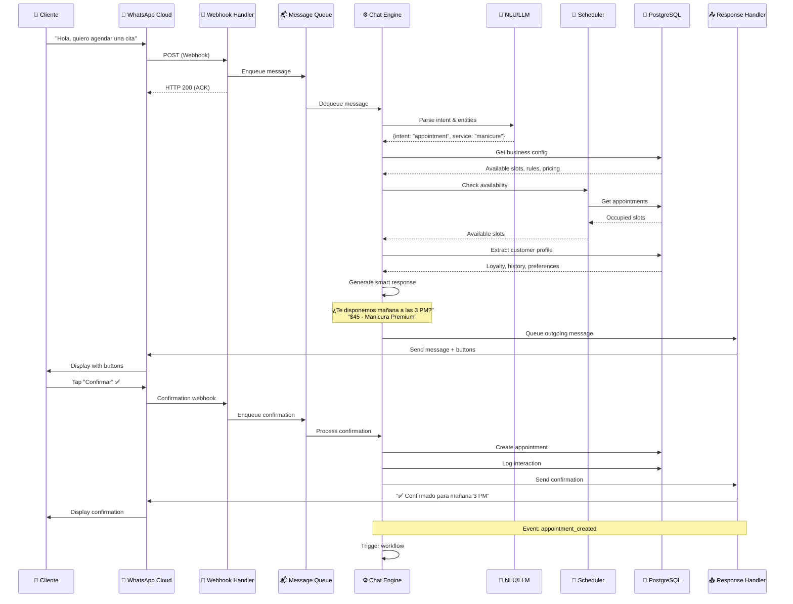

# 🏗️ ARQUITECTURA TÉCNICA MVP - GESTOR DE CITAS SaaS

**Documento Confidencial - Diseño de CTO Fundador**  
**Versión 1.0 | Junio 2026**

---

## 📋 ÍNDICE EJECUTIVO

- **Tiempo de desarrollo:** 50-60 días
- **Equipo mínimo:** 2 backend engineers + 1 fullstack frontend
- **Costo infraestructura mes 1:** $400-600 USD
- **Costo escalado (5,000 negocios):** $2,500-3,500 USD/mes
- **Modelo multi-tenant:** ✅ Desde el inicio
- **Escalabilidad:** Diseñado para 100K+ negocios

---

## 1️⃣ ARQUITECTURA GENERAL DEL SISTEMA

### 1.1 Visión de Capas

```
┌─────────────────────────────────────────────────────────────┐
│                    CAPA PRESENTACIÓN                        │
│  [Dashboard Web] [API Pública] [Webhooks Integrados]        │
└────────────────────┬────────────────────────────────────────┘
                     │
┌────────────────────▼────────────────────────────────────────┐
│                  CAPA APLICACIÓN                             │
│  [Auth Service] [Chat API] [Scheduling] [Reporting]         │
└────────────────────┬────────────────────────────────────────┘
                     │
┌────────────────────▼────────────────────────────────────────┐
│                   CAPA DOMINIO                               │
│  [Message Queue] [Workflow Engine] [Rules Engine]           │
└────────────────────┬────────────────────────────────────────┘
                     │
┌────────────────────▼────────────────────────────────────────┐
│                CAPA INTEGRACIÓN                              │
│  [WhatsApp API] [Instagram API] [TikTok API] [SMS API]      │
└────────────────────┬────────────────────────────────────────┘
                     │
┌────────────────────▼────────────────────────────────────────┐
│                  CAPA DATOS & CACHE                          │
│  [PostgreSQL] [Redis] [S3/Storage] [Elasticsearch]          │
└─────────────────────────────────────────────────────────────┘
```

### 1.2 Componentes Principales

| Componente | Responsabilidad | Escala Crítica |
|---|---|---|
| **Message Broker** | Async + confiabilidad de mensajes | 10K msgs/min |
| **Chat Engine** | Procesamiento de conversaciones | Latencia <2s |
| **Scheduler** | Gestión de citas y recordatorios | Exactitud 99.9% |
| **Webhook Handler** | Integración con WhatsApp/Instagram | P99 latency |
| **Auth & Multi-Tenant** | Aislamiento de datos + seguridad | Zero trust |
| **Rules Engine** | Lógica de negocio personalizable | 100ms decisión |

---

## 2️⃣ DIAGRAMA DE COMPONENTES



---

## 3️⃣ DIAGRAMA DE FLUJO - CASO DE USO PRINCIPAL

### Flujo: Cliente Solicita Cita vía WhatsApp



### Flujo: Sistema Envía Recordatorio

```mermaid
graph LR
    CRON["⏰ Cron Job<br/>Cada 5 min"]
    SCHEDULER["📅 Scheduler Service"]
    FILTER["🔍 Filter Pending<br/>24h before"]
    BATCH["📦 Batch Process<br/>Max 1000"]
    QUEUE["📬 Queue messages"]
    SENDER["📤 Send via<br/>WhatsApp API"]
    LOG["📊 Log Results"]
    
    CRON --> SCHEDULER
    SCHEDULER --> FILTER
    FILTER --> BATCH
    BATCH --> QUEUE
    QUEUE --> SENDER
    SENDER --> LOG
    
    style CRON fill:#fff4e6
    style SCHEDULER fill:#f0f7ff
    style FILTER fill:#f0f7ff
    style BATCH fill:#f0f7ff
    style QUEUE fill:#f5f5f5
    style SENDER fill:#fff4e6
    style LOG fill:#f5f5f5
```



---

## 4️⃣ TECNOLOGÍAS RECOMENDADAS

### Stack Backend - JUSTIFICACIÓN TÉCNICA

#### 4.1.1 Runtime & Framework

```
┌─────────────────────────────────────────────────────┐
│ OPCIÓN SELECCIONADA: Node.js + Express/Fastify      │
├─────────────────────────────────────────────────────┤
│ ✅ Ventajas:                                        │
│   • Desarrollo rápido (60 días)                     │
│   • JSON nativo (WhatsApp/Instagram APIs)          │
│   • Async/await excelente para I/O intensivo       │
│   • Ecosistema maduro (npm packages)                │
│   • Fácil de escalar horizontalmente                │
│   • TypeScript nativo para tipo seguro              │
│   • Teams pequeños lo dominan rápido               │
│                                                     │
│ ⚠️  Alternativas rechazadas:                        │
│   • Go: Más rápido, pero curva aprendizaje         │
│   • Python/FastAPI: Fácil, pero menos concurrencia │
│   • Rust: Overkill para MVP, tiempo desarrollo     │
│   • Java: Overhead, no para MVP rápido             │
└─────────────────────────────────────────────────────┘
```

**Framework específico: Fastify**
- **Por qué:** 2x más rápido que Express, built-in validation schema, plugins bien diseñados
- **Alternativa:** Express si el equipo lo conoce (diferencia menor en MVP)

```typescript
// Stack recomendado Node.js
{
  "runtime": "Node.js 20 LTS",
  "framework": "Fastify 5.0",
  "language": "TypeScript",
  "package_manager": "pnpm"
}
```

#### 4.1.2 Message Queue

```
┌─────────────────────────────────────────────────────┐
│ OPCIÓN SELECCIONADA: RabbitMQ OR Redis Streams     │
├─────────────────────────────────────────────────────┤
│ PREFERENCIA: Redis Streams (MVP)                    │
│ ────────────────────────────────────────────────────│
│ ✅ Ventajas:                                        │
│   • Una sola infraestructura (cache + queue)       │
│   • Más simple operacionalmente                     │
│   • Suficiente para 100K+ negocios                 │
│   • Menor latencia que RabbitMQ                    │
│   • Fácil de monitorear                            │
│                                                     │
│ ALTERNATIVA: RabbitMQ (cuando complejo)            │
│   • Si necesitas garantías transaccionales complejas│
│   • Cuando escales a 1M+ events/día                │
│   • Plugins específicos requeridos                 │
│                                                     │
│ RECHAZADA: AWS SQS                                 │
│   • Latencia (200ms+ vs 10ms local)               │
│   • Costo escala mal en MVP                        │
│   • Vendor lock-in innecesario                     │
└─────────────────────────────────────────────────────┘
```

**Throughput esperado:** 10,000 messages/min → Redis Streams ideal
**Garantías:** At-least-once delivery (suficiente con re-try logic)

#### 4.1.3 Base de Datos Primaria

```
┌─────────────────────────────────────────────────────┐
│ OPCIÓN SELECCIONADA: PostgreSQL 16                  │
├─────────────────────────────────────────────────────┤
│ ✅ Ventajas:                                        │
│   • Relaciones complejas (tenant > business > appts)│
│   • ACID transactions (confirmación citas crítica) │
│   • JSON columns (flexible para custom data)       │
│   • Full-text search (búsqueda conversaciones)     │
│   • Partitioning nativo (para escala)              │
│   • Row-level security (multi-tenant nativo)       │
│   • Extensiones: uuid-ossp, hstore, pg_trgm       │
│                                                     │
│ ⚠️  Alternativas rechazadas:                        │
│   • MongoDB: Transacciones débiles en MVP          │
│   • DynamoDB: Caro, overkill, schema inflexible   │
│   • MySQL: PostgreSQL superior en todo aspecto     │
│   • SQLite: No escala a multi-tenant               │
└─────────────────────────────────────────────────────┘
```

**Configuración recomendada:**
```sql
-- Extensiones necesarias
CREATE EXTENSION IF NOT EXISTS "uuid-ossp";
CREATE EXTENSION IF NOT EXISTS "pg_trgm";
CREATE EXTENSION IF NOT EXISTS "unaccent";

-- Row Level Security (multi-tenant nativo)
ALTER TABLE appointments ENABLE ROW LEVEL SECURITY;
CREATE POLICY tenant_isolation ON appointments
  USING (tenant_id = current_setting('app.current_tenant_id')::uuid);
```

#### 4.1.4 Cache & Sessions

```
┌─────────────────────────────────────────────────────┐
│ OPCIÓN SELECCIONADA: Redis 7.0+                     │
├─────────────────────────────────────────────────────┤
│ Casos de uso:                                       │
│ 1. Session storage (JWT tokens invalidation)       │
│ 2. Rate limiting (WhatsApp API limits)             │
│ 3. Caching (business config, availability)         │
│ 4. Message queue (Redis Streams)                   │
│ 5. Locks distribuidos (para evitar duplicados)     │
│                                                     │
│ TTL Strategy:                                       │
│ • Sessions: 7 días (con refresh token)             │
│ • Business config cache: 1 hora                    │
│ • Availability slots: 5 minutos                    │
│ • Rate limit buckets: 60 segundos                  │
└─────────────────────────────────────────────────────┘
```

#### 4.1.5 Búsqueda & Analytics

```
┌─────────────────────────────────────────────────────┐
│ OPCIÓN SELECCIONADA: Elasticsearch (MVP)           │
├─────────────────────────────────────────────────────┤
│ Alternativa simple: PostgreSQL full-text search   │
│                                                     │
│ MVP usa PostgreSQL, upgradea a ES cuando:          │
│   • > 100K conversaciones/mes                      │
│   • Necesitas filtros complejos en 0.5s            │
│   • Analytics en tiempo real                       │
│                                                     │
│ ⚠️  Elasticsearch es pesado para MVP               │
│   • Overhead operacional                          │
│   • Costo adicional ($500+/mes)                   │
│   • PostgreSQL cubre el 95% de casos              │
└─────────────────────────────────────────────────────┘
```

### Stack Frontend

```
┌─────────────────────────────────────────────────────┐
│ DASHBOARD WEB                                       │
├─────────────────────────────────────────────────────┤
│ Framework: React 18 + TypeScript                    │
│ UI Library: Shadcn/ui (headless, accesible)        │
│ State: TanStack Query (server state)               │
│ Styling: Tailwind CSS                              │
│ Build: Vite (x10 más rápido que CRA)               │
│ Hosting: Vercel (auto-deploy desde Git)            │
│                                                     │
│ MOBILE APP (Fase 2, no MVP)                        │
├─────────────────────────────────────────────────────┤
│ Framework: React Native + Expo                      │
│ O: Flutter (si nuevo proyecto)                     │
│                                                     │
│ JUSTIFICACIÓN:                                      │
│ • MVP solo necesita dashboard web                  │
│ • Mobile es feature secundario                     │
│ • Web responsivo en tablets suficiente              │
│ • Prioriza llegada a mercado                       │
└─────────────────────────────────────────────────────┘
```

### Stack de Infraestructura

#### 4.4.1 Containerización

```
┌─────────────────────────────────────────────────────┐
│ SELECCIONADO: Docker + Docker Compose              │
├─────────────────────────────────────────────────────┤
│ • Garantiza entorno consistente dev/prod           │
│ • Cada servicio en su propio contenedor            │
│ • Fácil de localizar en laptop de dev              │
│                                                     │
│ Alternativa: Kubernetes                            │
│ ❌ NO para MVP - overhead operacional alto          │
│ ✅ Considerar cuando: > 50K usuarios               │
└─────────────────────────────────────────────────────┘
```

#### 4.4.2 Hosting & Orquestación

```
┌─────────────────────────────────────────────────────┐
│ OPCIÓN 1 (RECOMENDADO): DigitalOcean App Platform  │
├─────────────────────────────────────────────────────┤
│ Ventajas:                                           │
│ • Deploy desde Git (push-to-deploy)                │
│ • PostgreSQL managed automático                    │
│ • Redis managed                                    │
│ • Escalado horizontal con 1 click                  │
│ • Costo predecible                                 │
│ • No requiere Kubernetes                           │
│ • Soporte solid para MVP                           │
│                                                     │
│ Costo (MVP inicial):                               │
│ • 2x App containers: $20/mes                       │
│ • PostgreSQL (1GB): $15/mes                        │
│ • Redis (512MB): $15/mes                           │
│ • TOTAL: $50/mes + overages                        │
│                                                     │
│ ────────────────────────────────────────────────────│
│ OPCIÓN 2: AWS (si necesitas compliance ISO/HIPAA) │
├─────────────────────────────────────────────────────┤
│ • ECS Fargate (serverless containers)              │
│ • RDS PostgreSQL Multi-AZ                          │
│ • ElastiCache Redis                                │
│ • Application Load Balancer                        │
│ • CloudFront CDN                                   │
│ • CloudWatch Monitoring                            │
│                                                     │
│ Costo (MVP):                                       │
│ • ECS Fargate: ~$100/mes                           │
│ • RDS: ~$50/mes (t3.micro)                         │
│ • ElastiCache: ~$30/mes                            │
│ • ALB: ~$20/mes                                    │
│ • TOTAL: ~$200/mes + data transfer                 │
│                                                     │
│ ────────────────────────────────────────────────────│
│ OPCIÓN 3: Vercel + Railway (PARA STARTUPS)         │
├─────────────────────────────────────────────────────┤
│ • Vercel: Frontend (Next.js, free tier viable)    │
│ • Railway: Backend + PostgreSQL + Redis            │
│ • Más simple que AWS, más barato que DigitalOcean  │
│ • Costo: ~$20-40/mes (muy MVP-friendly)            │
│ • Escalado automático                              │
└─────────────────────────────────────────────────────┘
```

**RECOMENDACIÓN PARA ESTE MVP:** DigitalOcean App Platform
- Punto dulce entre simplicidad y costo
- Suficiente para primeros 10K-50K negocios
- Escala fácil si necesitas más

#### 4.4.3 DNS, SSL, CDN

```
┌─────────────────────────────────────────────────────┐
│ DNS: CloudFlare (gratuito tier)                     │
│ • Gestión de DNS simple                            │
│ • SSL automático (Let's Encrypt gratuito)          │
│ • DDoS protection básico                           │
│ • API para DNS programático (webhooks)             │
│                                                     │
│ CDN: CloudFlare (incluido)                         │
│ • Caching global de assets                         │
│ • Compression automático                           │
│ • Reglas de firewall                               │
│                                                     │
│ Alternativa: AWS Route53 + CloudFront              │
│ (si ya usas AWS)                                   │
└─────────────────────────────────────────────────────┘
```

#### 4.4.4 Monitoreo & Observabilidad

```
┌─────────────────────────────────────────────────────┐
│ Logging: 
│ • stdout → CloudFlare Logpush o AWS CloudWatch     │
│ • Parseado con structured logging (JSON)           │
│ • Rotación automática                              │
│                                                     │
│ Metrics:
│ • Prometheus (open-source, self-hosted)            │
│ • O: Datadog (pago, pero excelente para startups) │
│                                                     │
│ Tracing:
│ • Jaeger (open-source, self-hosted)               │
│ • O: Tempo (Grafana, integrado con Prometheus)     │
│                                                     │
│ Error Tracking:
│ • Sentry (free tier cubre MVP)                     │
│ • Alertas automáticas en Slack                     │
│                                                     │
│ Uptime Monitoring:
│ • Checkly (tests sintéticos, $12/mes)             │
│ • Monitorea endpoints críticos cada minuto         │
│                                                     │
│ Stack recomendado para MVP:                        │
│ • Sentry (errores)                                 │
│ • Checkly (uptime)                                 │
│ • CloudFlare Analytics (básico)                    │
│ COSTO TOTAL: ~$20-30/mes                          │
└─────────────────────────────────────────────────────┘
```

---

## 5️⃣ DISEÑO MULTI-TENANT

### 5.1 Estrategia de Aislamiento

```
┌──────────────────────────────────────────────────────┐
│ MULTI-TENANCY: Database-per-Tenant (RECOMENDADO)   │
├──────────────────────────────────────────────────────┤
│                                                      │
│ OPCIÓN 1: Shared database + row-level security (RLS)│
│ ────────────────────────────────────────────────────│
│ Pros:                                               │
│ • Operacionalmente más simple                      │
│ • Costos menores                                   │
│ • Fácil para MVP                                   │
│                                                      │
│ Contras:                                            │
│ • Performance degrada con muchos tenants            │
│ • Riesgo de data leaks si RLS falla               │
│ • Backups más complejos                            │
│                                                      │
│ RECOMENDACIÓN: USA ESTO para MVP                   │
│ (Cambio a database-per-tenant en escala)           │
│                                                      │
│ ────────────────────────────────────────────────────│
│ OPCIÓN 2: Database-per-Tenant                       │
│ ────────────────────────────────────────────────────│
│ Pros:                                               │
│ • Máximo aislamiento (seguridad)                   │
│ • Mejor performance (no contención)                │
│ • Fácil escalado vertical                          │
│ • Backups/restore por tenant                       │
│                                                      │
│ Contras:                                            │
│ • Overhead operacional (N databases)                │
│ • Migraciones más complejas                        │
│ • Costo aumenta linealmente                        │
│                                                      │
│ RECOMENDACIÓN: Upgrade cuando > 1000 tenants       │
│                                                      │
│ ────────────────────────────────────────────────────│
│ OPCIÓN 3: Hybrid (nuestro roadmap)                 │
│ ────────────────────────────────────────────────────│
│ Estructura:                                         │
│ • 1 shared database para metadata + auth          │
│ • N databases de negocio (uno por tenant)          │
│ • Routing automático por tenant_id                 │
│                                                      │
│ IMPLEMENTACIÓN:                                     │
│ 1. MVP (meses 1-2): Shared + RLS                  │
│ 2. Post-MVP (mes 3): Agregar database-per-tenant │
│ 3. Maduración (mes 6+): Full separation            │
└──────────────────────────────────────────────────────┘
```

### 5.2 Implementación Técnica (MVP - Shared Database)

#### 5.2.1 Modelo de Base de Datos

```sql
-- Tabla central: Tenants
CREATE TABLE tenants (
  id UUID PRIMARY KEY DEFAULT uuid_generate_v4(),
  name VARCHAR(255) NOT NULL,
  slug VARCHAR(255) UNIQUE NOT NULL,
  plan VARCHAR(50) DEFAULT 'free', -- free, pro, enterprise
  status VARCHAR(50) DEFAULT 'active', -- active, suspended, archived
  created_at TIMESTAMP DEFAULT NOW(),
  stripe_customer_id VARCHAR(255),
  settings JSONB DEFAULT '{}'::jsonb,
  
  UNIQUE(slug)
);

-- Tabla de usuarios (pueden ser de múltiples tenants)
CREATE TABLE users (
  id UUID PRIMARY KEY DEFAULT uuid_generate_v4(),
  tenant_id UUID REFERENCES tenants(id) ON DELETE CASCADE,
  email VARCHAR(255) NOT NULL,
  password_hash VARCHAR(255) NOT NULL,
  name VARCHAR(255),
  role VARCHAR(50) DEFAULT 'user', -- admin, manager, user
  status VARCHAR(50) DEFAULT 'active',
  created_at TIMESTAMP DEFAULT NOW(),
  
  UNIQUE(tenant_id, email)
);

-- Tabla de negocios (businesses dentro del tenant)
CREATE TABLE businesses (
  id UUID PRIMARY KEY DEFAULT uuid_generate_v4(),
  tenant_id UUID REFERENCES tenants(id) ON DELETE CASCADE,
  name VARCHAR(255) NOT NULL,
  slug VARCHAR(255),
  business_type VARCHAR(100), -- barber, manicure, dental, etc
  phone VARCHAR(20),
  whatsapp_number VARCHAR(20),
  instagram_handle VARCHAR(255),
  timezone VARCHAR(50) DEFAULT 'America/New_York',
  settings JSONB DEFAULT '{}'::jsonb,
  created_at TIMESTAMP DEFAULT NOW(),
  
  UNIQUE(tenant_id, slug)
);

-- Tabla de clientes (customers del negocio)
CREATE TABLE customers (
  id UUID PRIMARY KEY DEFAULT uuid_generate_v4(),
  business_id UUID REFERENCES businesses(id) ON DELETE CASCADE,
  tenant_id UUID REFERENCES tenants(id) ON DELETE CASCADE,
  phone VARCHAR(20) NOT NULL,
  name VARCHAR(255),
  email VARCHAR(255),
  whatsapp_id VARCHAR(255), -- External ID from WhatsApp
  instagram_id VARCHAR(255),
  lifetime_value DECIMAL(10, 2) DEFAULT 0,
  preferences JSONB DEFAULT '{}'::jsonb,
  created_at TIMESTAMP DEFAULT NOW(),
  last_interaction TIMESTAMP,
  
  UNIQUE(business_id, phone),
  INDEX(tenant_id, whatsapp_id)
);

-- Tabla de citas
CREATE TABLE appointments (
  id UUID PRIMARY KEY DEFAULT uuid_generate_v4(),
  business_id UUID REFERENCES businesses(id) ON DELETE CASCADE,
  tenant_id UUID REFERENCES tenants(id) ON DELETE CASCADE,
  customer_id UUID REFERENCES customers(id) ON DELETE SET NULL,
  service_id UUID REFERENCES services(id),
  scheduled_at TIMESTAMP NOT NULL,
  duration_minutes INTEGER DEFAULT 30,
  status VARCHAR(50) DEFAULT 'scheduled', -- scheduled, confirmed, cancelled, completed
  notes JSONB DEFAULT '{}'::jsonb,
  created_at TIMESTAMP DEFAULT NOW(),
  updated_at TIMESTAMP DEFAULT NOW(),
  
  INDEX(tenant_id, business_id, scheduled_at),
  INDEX(tenant_id, status)
);

-- Tabla de servicios
CREATE TABLE services (
  id UUID PRIMARY KEY DEFAULT uuid_generate_v4(),
  business_id UUID REFERENCES businesses(id) ON DELETE CASCADE,
  tenant_id UUID REFERENCES tenants(id) ON DELETE CASCADE,
  name VARCHAR(255) NOT NULL,
  price DECIMAL(10, 2) NOT NULL,
  duration_minutes INTEGER DEFAULT 30,
  description TEXT,
  enabled BOOLEAN DEFAULT true,
  created_at TIMESTAMP DEFAULT NOW(),
  
  INDEX(tenant_id, business_id)
);

-- Tabla de conversaciones
CREATE TABLE conversations (
  id UUID PRIMARY KEY DEFAULT uuid_generate_v4(),
  business_id UUID REFERENCES businesses(id) ON DELETE CASCADE,
  tenant_id UUID REFERENCES tenants(id) ON DELETE CASCADE,
  customer_id UUID REFERENCES customers(id) ON DELETE SET NULL,
  channel VARCHAR(50) NOT NULL, -- whatsapp, instagram, facebook
  external_id VARCHAR(255), -- WhatsApp conversation ID
  status VARCHAR(50) DEFAULT 'active', -- active, archived, closed
  created_at TIMESTAMP DEFAULT NOW(),
  updated_at TIMESTAMP DEFAULT NOW(),
  
  UNIQUE(business_id, external_id),
  INDEX(tenant_id, status)
);

-- Tabla de mensajes
CREATE TABLE messages (
  id UUID PRIMARY KEY DEFAULT uuid_generate_v4(),
  conversation_id UUID REFERENCES conversations(id) ON DELETE CASCADE,
  tenant_id UUID REFERENCES tenants(id) ON DELETE CASCADE,
  sender_type VARCHAR(50) NOT NULL, -- user, customer, system
  content TEXT NOT NULL,
  message_type VARCHAR(50) DEFAULT 'text', -- text, button, template, file
  metadata JSONB DEFAULT '{}'::jsonb,
  external_id VARCHAR(255), -- WhatsApp message ID
  created_at TIMESTAMP DEFAULT NOW(),
  
  INDEX(tenant_id, conversation_id, created_at)
);

-- MULTI-TENANT ROW LEVEL SECURITY
ALTER TABLE tenants ENABLE ROW LEVEL SECURITY;
ALTER TABLE users ENABLE ROW LEVEL SECURITY;
ALTER TABLE businesses ENABLE ROW LEVEL SECURITY;
ALTER TABLE customers ENABLE ROW LEVEL SECURITY;
ALTER TABLE appointments ENABLE ROW LEVEL SECURITY;
ALTER TABLE conversations ENABLE ROW LEVEL SECURITY;
ALTER TABLE messages ENABLE ROW LEVEL SECURITY;

-- Policies básicas (ejemplo para appointments)
CREATE POLICY tenant_isolation ON appointments
  USING (tenant_id = current_setting('app.current_tenant_id')::uuid);

CREATE POLICY tenant_isolation_insert ON appointments
  WITH CHECK (tenant_id = current_setting('app.current_tenant_id')::uuid);
```

#### 5.2.2 Contexto de Tenant en la Aplicación

```typescript
// middleware/tenantContext.ts
import { FastifyInstance, FastifyRequest, FastifyReply } from 'fastify';
import jwt from '@fastify/jwt';

declare global {
  namespace Express {
    interface Request {
      tenantId: string;
      userId: string;
      user: { id: string; email: string; role: string };
    }
  }
}

export async function tenantContextPlugin(fastify: FastifyInstance) {
  fastify.register(jwt, { secret: process.env.JWT_SECRET! });

  fastify.addHook('preHandler', async (request: FastifyRequest, reply: FastifyReply) => {
    try {
      // Verificar JWT y extraer tenant_id
      await request.jwtVerify();
      
      const token = request.user as any;
      request.tenantId = token.tenant_id;
      request.userId = token.sub;
      
      // Establecer contexto para PostgreSQL RLS
      const db = fastify.db;
      await db.query(
        `SET app.current_tenant_id TO '${request.tenantId}'`
      );
      
    } catch (error) {
      reply.code(401).send({ error: 'Unauthorized' });
    }
  });
}

// Uso en rutas
fastify.get('/appointments', async (request: FastifyRequest, reply: FastifyReply) => {
  // request.tenantId ya está disponible y garantizado
  const appointments = await db.query(
    `SELECT * FROM appointments WHERE tenant_id = $1`,
    [request.tenantId]
  );
  return appointments;
});
```

---

## 6️⃣ ESTRATEGIA DE ESCALABILIDAD

### 6.1 Fases de Crecimiento

```
┌──────────────────────────────────────────────────────┐
│ FASE 1: MVP (Meses 0-2)                              │
├──────────────────────────────────────────────────────┤
│ Target: 0 → 500 negocios                            │
│ MAU: 0 → 50K                                         │
│ Mensajes/día: 0 → 100K                               │
│                                                      │
│ Stack MVP:                                           │
│ • 2x Node.js containers (load balanced)             │
│ • 1x PostgreSQL (t3.small, 40GB)                    │
│ • 1x Redis (256MB)                                  │
│ • CloudFlare CDN                                    │
│ • Sentry + Checkly para monitoring                  │
│                                                      │
│ Costo: $50-100/mes                                   │
│                                                      │
│ ────────────────────────────────────────────────────│
│ FASE 2: Estabilización (Meses 2-4)                  │
├──────────────────────────────────────────────────────┤
│ Target: 500 → 5K negocios                           │
│ MAU: 50K → 500K                                     │
│ Mensajes/día: 100K → 1M                             │
│                                                      │
│ Cambios:                                             │
│ • 4x Node.js containers (auto-scaling)              │
│ • PostgreSQL → t3.large (120GB, read replicas)     │
│ • Redis → 1GB (cluster si necesario)                │
│ • Elasticsearch para búsqueda (opcional)            │
│ • Background jobs (Bullmq)                          │
│ • Separate webhook handler (100% throughput)        │
│                                                      │
│ Costo: $300-500/mes                                 │
│                                                      │
│ ────────────────────────────────────────────────────│
│ FASE 3: Escala (Meses 4-12)                         │
├──────────────────────────────────────────────────────┤
│ Target: 5K → 50K negocios                           │
│ MAU: 500K → 5M                                      │
│ Mensajes/día: 1M → 10M                              │
│                                                      │
│ Cambios arquitectónicos:                             │
│ • Multi-region deployment (latency)                 │
│ • Database-per-tenant (algunos clientes enterprise) │
│ • Kubernetes (si ARM-heavy)                         │
│ • Elasticsearch obligatorio                         │
│ • Separate analytics DB (data warehouse)            │
│ • Message broker specialization:                    │
│   - RabbitMQ para garantías transaccionales        │
│   - Redis para caché/rate-limiting                 │
│ • CDN mejorado (CloudFront si AWS)                  │
│                                                      │
│ Costo: $1K-2K/mes                                   │
│                                                      │
│ ────────────────────────────────────────────────────│
│ FASE 4: Enterprise (Meses 12+)                      │
├──────────────────────────────────────────────────────┤
│ Target: 50K+ negocios                               │
│ MAU: 5M+                                            │
│                                                      │
│ Infraestructura dedicada:                            │
│ • Kubernetes con auto-scaling                       │
│ • PostgreSQL + Sharding por región                  │
│ • Redis Cluster                                     │
│ • Elasticsearch en cluster                          │
│ • DynamoDB para analytics                           │
│ • S3 para archivos                                  │
│ • CloudFront global                                 │
│ • Terraform/IaC para reproducibilidad               │
│                                                      │
│ Costo: $5K-10K+/mes                                 │
└──────────────────────────────────────────────────────┘
```

### 6.2 Bottlenecks & Soluciones

| Bottleneck | MVP | Fase 2 | Fase 3 |
|---|---|---|---|
| **API Gateway** | Nginx | AWS ALB | CloudFlare Workers + Global Load Balancer |
| **Database Writes** | Single PG | RLS + Read replicas | Database sharding |
| **Message Processing** | Redis Streams | RabbitMQ queue | Kafka/Pulsar |
| **Real-time Features** | WebSocket singular | Redis Pub/Sub | Dedicated WS layer |
| **File Storage** | Local + S3 | S3 + CloudFront | Multi-region S3 + CDN |
| **Search** | PostgreSQL FTS | Elasticsearch | ES Cluster + Analytics |

### 6.3 Cálculo de Capacidad

```
┌─────────────────────────────────────────────────────┐
│ ESTIMACIONES POR SERVIDOR                           │
├─────────────────────────────────────────────────────┤
│ Node.js Fastify container (t3.micro, 512MB RAM):    │
│ • 100-200 conexiones WebSocket simultáneas          │
│ • 1000-2000 req/sec (JSON)                          │
│ • 50-100 conversaciones activas                     │
│                                                     │
│ PostgreSQL (t3.small, 2GB RAM):                     │
│ • 500-1000 conexiones                              │
│ • 1000-2000 queries/sec                            │
│ • 100GB almacenamiento (~1M registros por tabla)   │
│                                                     │
│ Redis (256MB):                                      │
│ • 100K keys máximo                                 │
│ • 50K ops/sec                                      │
│ • Sessions + cache + queue                         │
│                                                     │
│ EJEMPLO (500 negocios):                            │
│ • Promedio 100 clientes/negocio                    │
│ • 50K clientes total                               │
│ • 10% actividad diaria (5K clientes)               │
│ • 2 mensajes/cliente/día (10K msgs)                │
│ • 100 citas/mes/negocio (50K citas)                │
│ • Requiere: 2 servidores + PG + Redis (pico)      │
└─────────────────────────────────────────────────────┘
```

---

## 7️⃣ COSTOS APROXIMADOS

### 7.1 Costo Inicial (MVP)

```
┌────────────────────────────────────────────────────┐
│ INFRAESTRUCTURA (Primer Mes)                       │
├────────────────────────────────────────────────────┤
│ DigitalOcean App Platform:                         │
│   • 2x Node.js app tier (basic) .......... $20/mes  │
│   • PostgreSQL managed 1GB .............. $15/mes   │
│   • Redis managed 256MB ................. $15/mes   │
│ SUBTOTAL: $50/mes                                  │
│                                                    │
│ CloudFlare:                                        │
│   • DNS + CDN + SSL ..................... FREE      │
│   • DDoS protection (basic) ............ FREE       │
│                                                    │
│ Sentry (Error tracking):                          │
│   • Free tier (5K events/mes) ........... FREE      │
│   • Upgrade si necesario ............... $29+/mes   │
│                                                    │
│ Checkly (Uptime monitoring):                      │
│   • Free tier (10 checks) .............. FREE       │
│   • Pro tier .......................... $20/mes     │
│                                                    │
│ SendGrid (Email service):                         │
│   • Free tier (100 emails/día) ........ FREE        │
│   • Pago (si > 100 emails/día) ....... ~$10/mes    │
│                                                    │
│ SUBTOTAL SERVICES: ~$30/mes (con upgrades)        │
│                                                    │
│ ────────────────────────────────────────────────────│
│ TOTAL INFRAESTRUCTURA: ~$80-100/mes                │
└────────────────────────────────────────────────────┘
```

### 7.2 Costo Escalado (10K Negocios)

```
┌────────────────────────────────────────────────────┐
│ Estimación con 10K negocios (1M+ clientes)        │
├────────────────────────────────────────────────────┤
│ DigitalOcean o AWS:                                │
│   • 4-8 app containers ................. $200/mes   │
│   • PostgreSQL (t3.large, 120GB) ....... $100/mes   │
│   • Redis cluster (1GB) ................ $50/mes    │
│   • CDN + bandwidth .................... $100/mes   │
│ SUBTOTAL: $450/mes                                 │
│                                                    │
│ Elasticsearch (si implementado):                   │
│   • 2-node cluster .................... $500/mes    │
│                                                    │
│ Other services:                                    │
│   • Sentry pro ....................... $200/mes    │
│   • Datadog (monitoring) ............. $500/mes    │
│   • Twilio/SendGrid (SMS + Email) ... $200/mes    │
│                                                    │
│ TOTAL: $1.85K - 2.15K/mes                         │
│                                                    │
│ Costo por negocio: $0.185 - 0.215 USD/mes        │
│ Margen de ganancia: 3-5x (con plan free/pro)     │
└────────────────────────────────────────────────────┘
```

### 7.3 Costos de Desarrollo (Equipo)

```
┌────────────────────────────────────────────────────┐
│ TEAM ALLOCATION (60 días MVP)                      │
├────────────────────────────────────────────────────┤
│ 1x Senior Backend Engineer (Full-time):            │
│   • Architecture, Core APIs ........... $120K/año   │
│   • 60 días .......................... $20K          │
│                                                    │
│ 1x Backend Engineer (Full-time):                   │
│   • Integration, Webhooks ............ $80K/año    │
│   • 60 días .......................... $13K         │
│                                                    │
│ 1x Fullstack Frontend Engineer (Full-time):       │
│   • Dashboard, UX .................... $90K/año    │
│   • 60 días .......................... $15K         │
│                                                    │
│ TOTAL SALARIOS (60 días): $48K                    │
│                                                    │
│ ────────────────────────────────────────────────────│
│ OTROS COSTOS                                       │
│   • SaaS tools (GitHub, Slack, etc) ... $500       │
│   • Licenses/APIs ..................... $1K        │
│   • Infrastructura dev ............... $200        │
│ SUBTOTAL: $1.7K                                    │
│                                                    │
│ TOTAL MVP DEVELOPMENT: ~$50K                      │
│ (Si usas contractors: $40-60K)                    │
└────────────────────────────────────────────────────┘
```

---

## 8️⃣ RIESGOS TÉCNICOS

### 8.1 Matriz de Riesgos

| Riesgo | Probabilidad | Impacto | Mitigación |
|--------|--|--|---|
| **Data loss (citas/clientes)** | Baja (5%) | Crítica | PostgreSQL ACID + backups automáticos 2x día + WAL archiving |
| **WhatsApp API rate limits** | Media (30%) | Alta | Queue system con retry + exponential backoff |
| **Message delivery failures** | Media (25%) | Media | Idempotency keys + delivery receipts + manual resend |
| **Multi-tenant data leak** | Baja (10%) | Crítica | PostgreSQL RLS + code audit + pentest antes de escala |
| **DDoS en webhook endpoint** | Baja (5%) | Alta | CloudFlare DDoS + rate limiting por IP |
| **Database connection pool exhaustion** | Media (20%) | Media | Connection pooling (PgBouncer) + monitoring |
| **Cold start latency (API)** | Media (40%) | Baja | Keep-alive pings + pre-warming |
| **Timezone/daylight savings issues** | Media (30%) | Media | UTC en DB + timezone en user settings |
| **Concurrency on appointment booking** | Media (25%) | Alta | Pessimistic locking + optimistic retry logic |
| **Third-party API downtime** | Alta (60%) | Media | Graceful degradation + fallback messages + queue retry |

### 8.2 Plan de Mitigación

#### 8.2.1 Backup & Disaster Recovery

```yaml
Backup Strategy:
  PostgreSQL:
    - Automated snapshots: Every 6 hours
    - WAL archiving: Continuous to S3
    - Point-in-time recovery: Last 30 days
    - Cross-region replica: Optional (Fase 2)
  
  Recovery Time Objective (RTO): 1 hour
  Recovery Point Objective (RPO): 6 hours
  
  Testing:
    - Monthly DR drill
    - Restore from latest backup to dev environment
    - Verify data integrity
```

#### 8.2.2 Rate Limiting & Quota Management

```typescript
// Rate limiting strategy for WhatsApp API
const WHATSAPP_LIMITS = {
  messages_per_second: 80, // Official limit
  conversation_limit: 1000, // Per 24h
};

// Queue with backpressure
class MessageQueue {
  async sendMessage(msg: Message, retries = 3) {
    try {
      // Check rate limit
      const canSend = await this.checkRateLimit(msg.business_id);
      if (!canSend) {
        // Queue for later
        await this.queue.add(msg, { delay: 60000 });
        return;
      }
      
      // Send with timeout
      const result = await timeout(
        this.whatsappClient.send(msg),
        5000
      );
      
      // Log delivery
      await this.logDelivery(msg.id, result);
      
    } catch (error) {
      if (retries > 0) {
        // Exponential backoff: 1s, 2s, 4s, 8s
        const delay = Math.pow(2, 3 - retries) * 1000;
        await this.queue.add(msg, { delay, retries: retries - 1 });
      } else {
        // Mark as failed, alert admin
        await this.markFailed(msg.id);
        await this.alertAdmin(`Message ${msg.id} failed after retries`);
      }
    }
  }
}
```

#### 8.2.3 Idempotency & Duplicate Prevention

```typescript
// Idempotency key pattern
class ApiHandler {
  async handleWebhook(req: FastifyRequest) {
    const idempotencyKey = req.headers['idempotency-key'] || 
                          req.body.message_id;
    
    // Check if already processed
    const existing = await redis.get(`idempotent:${idempotencyKey}`);
    if (existing) {
      return JSON.parse(existing);
    }
    
    try {
      const result = await this.processMessage(req.body);
      
      // Cache result with TTL
      await redis.setex(
        `idempotent:${idempotencyKey}`,
        3600, // 1 hour
        JSON.stringify(result)
      );
      
      return result;
    } catch (error) {
      throw error;
    }
  }
}
```

---

## 9️⃣ SECURITY & COMPLIANCE

### 9.1 Medidas de Seguridad MVP

```
┌────────────────────────────────────────────────────┐
│ AUTENTICACIÓN & AUTORIZACIÓN                       │
├────────────────────────────────────────────────────┤
│ • JWT tokens (RS256) con refresh tokens            │
│ • Password hashing: bcrypt (rounds: 12)            │
│ • 2FA: TOTP (Time-based OTP) para admins          │
│ • Role-based access control (RBAC)                 │
│   - Admin: Full access                            │
│   - Manager: Negocio específico                   │
│   - User: Read-only o específico                  │
│                                                    │
├────────────────────────────────────────────────────┤
│ TRANSPORT SECURITY                                 │
│                                                    │
│ • HTTPS/TLS 1.3 en todo (CloudFlare enforce)      │
│ • HSTS (Strict-Transport-Security) headers        │
│ • Certificate pinning (mobile app - Fase 2)       │
│ • API rate limiting (per user, per IP)            │
│                                                    │
├────────────────────────────────────────────────────┤
│ DATABASE SECURITY                                  │
│                                                    │
│ • RLS (Row-Level Security) obligatorio            │
│ • No passwords en plaintext (nunca)               │
│ • Encrypted fields (datos sensibles)               │
│   - Credit card tokens (si implementado): Stripe  │
│   - API keys: Encrypted at rest                   │
│ • Prepared statements (previene SQL injection)    │
│ • Connection pooling con timeout                  │
│                                                    │
├────────────────────────────────────────────────────┤
│ INPUT VALIDATION & SANITIZATION                   │
│                                                    │
│ • JSON Schema validation (Fastify)                │
│ • XSS prevention: DOMPurify en frontend           │
│ • CSRF protection: SameSite cookies               │
│ • Rate limiting en endpoints públicos             │
│                                                    │
├────────────────────────────────────────────────────┤
│ API SECURITY                                       │
│                                                    │
│ • Webhooks validados con X-Signature (HMAC)       │
│ • Webhook IP whitelisting (WhatsApp IPs)          │
│ • API keys scoped (read/write, por recurso)       │
│ • Secrets management: Environment variables        │
│   (NO en code, NO en git)                         │
│                                                    │
├────────────────────────────────────────────────────┤
│ LOGGING & MONITORING                              │
│                                                    │
│ • Structured logging (JSON)                       │
│ • Logs centralizados (CloudFlare o CloudWatch)   │
│ • NO sensible data en logs (PII redacted)        │
│ • Sentry para exceptions en prod                 │
│ • Audit logs para cambios críticos               │
│                                                    │
├────────────────────────────────────────────────────┤
│ GDPR & PRIVACY COMPLIANCE                         │
│                                                    │
│ • Privacy policy & TOS en sitio                   │
│ • Data export (GDPR right to data)               │
│ • Data deletion (GDPR right to be forgotten)     │
│ • Consent tracking (email, SMS, marketing)       │
│ • DPA con procesos (si clientes EU)              │
│                                                    │
│ Nota: Compliance full es para post-MVP            │
│ (MVP: Security by design, compliance gradual)     │
└────────────────────────────────────────────────────┘
```

### 9.2 Checklist Pre-Launch

```
□ ANTES DE LANZAR A PRODUCCIÓN
├─ Security
│  ├─ [ ] JWT secret rotado y strong (>32 chars)
│  ├─ [ ] Environment variables (.env) NO en git
│  ├─ [ ] HTTPS/TLS habilitado en todos los endpoints
│  ├─ [ ] RLS policies testeadas y verificadas
│  ├─ [ ] CORS configurado correctamente (whitelist)
│  ├─ [ ] SQL injection tests (manual + automated)
│  ├─ [ ] XSS tests en dashboard
│  └─ [ ] Secrets (API keys, DB pwd) rotados
│
├─ Database
│  ├─ [ ] Backups automatizados configurados
│  ├─ [ ] WAL archiving habilitado
│  ├─ [ ] Índices optimizados (EXPLAIN ANALYZE)
│  ├─ [ ] Foreign keys con cascades (si aplica)
│  ├─ [ ] Connection pooling configurado
│  └─ [ ] Restore test exitoso
│
├─ API & Webhooks
│  ├─ [ ] WhatsApp webhook X-Signature verificado
│  ├─ [ ] Idempotency keys implementadas
│  ├─ [ ] Rate limiting funcional
│  ├─ [ ] Error handling graceful
│  ├─ [ ] Timeouts configurados (5s max)
│  └─ [ ] Retry logic con exponential backoff
│
├─ Monitoring & Logging
│  ├─ [ ] Sentry conectado y funcionando
│  ├─ [ ] Logs centralizados y estructura JSON
│  ├─ [ ] Alertas en Slack (critical errors)
│  ├─ [ ] Dashboard de métricas (CPU, memory, DB)
│  └─ [ ] Uptime monitoring (Checkly)
│
├─ Frontend
│  ├─ [ ] Build optimizado (Vite)
│  ├─ [ ] Minified & bundled
│  ├─ [ ] Service worker / offline support (opcional)
│  ├─ [ ] Error boundary implementado
│  └─ [ ] Performance test (Lighthouse >80)
│
└─ Documentation
   ├─ [ ] API documentation (OpenAPI/Swagger)
   ├─ [ ] Runbook para oncall
   ├─ [ ] Incident response procedure
   └─ [ ] Database schema documented
```

---

## 🔟 ROADMAP TÉCNICO (12 MESES)

### 10.1 Timeline Ejecutivo

```
┌────────────────────────────────────────────────────┐
│ SPRINT 1-2 (Semanas 1-4)  - MVP Core              │
├────────────────────────────────────────────────────┤
│ ✓ Setup inicial (repos, CI/CD, infra)             │
│ ✓ Database schema + migrations                    │
│ ✓ Auth system (JWT, multi-tenant)                 │
│ ✓ WhatsApp webhook integration                    │
│ ✓ Basic chat engine (rules-based)                 │
│ ✓ Simple appointment scheduling                   │
│ ✓ Dashboard básico (citas, clientes)              │
│ ✓ Error handling + logging                        │
│                                                   │
│ ENTREGABLE: MVP funcional beta                    │
│ DEPLOY: Beta privado (select customers)           │
└────────────────────────────────────────────────────┘

┌────────────────────────────────────────────────────┐
│ SPRINT 3 (Semanas 5-8) - MVP Robusto              │
├────────────────────────────────────────────────────┤
│ ✓ Instagram DM integration                        │
│ ✓ Message templates & personalization             │
│ ✓ Automated reminders (24h before)                │
│ ✓ Customer analytics dashboard                    │
│ ✓ Export reports (CSV, PDF)                       │
│ ✓ Performance optimizations                       │
│ ✓ Load testing + stress tests                     │
│ ✓ Security audit (manual)                         │
│                                                   │
│ ENTREGABLE: MVP stable, listo para público        │
│ DEPLOY: Producción general                        │
└────────────────────────────────────────────────────┘

┌────────────────────────────────────────────────────┐
│ SPRINT 4 (Semanas 9-12) - Post-MVP Push           │
├────────────────────────────────────────────────────┤
│ ✓ Facebook Messenger integration                  │
│ ✓ Advanced NLU (intent recognition)               │
│ ✓ Custom business rules engine                    │
│ ✓ SMS notifications (Twilio)                      │
│ ✓ Team collaboration features                     │
│ ✓ API webhooks para integraciones custom          │
│ ✓ Mobile app (React Native) - START               │
│                                                   │
│ ENTREGABLE: Feature-rich product                  │
│ DEPLOY: Continuous                                │
│ USUARIOS: 1K+ negocios                            │
└────────────────────────────────────────────────────┘

┌────────────────────────────────────────────────────┐
│ FASE 2: Escala & Estabilidad (Meses 5-6)         │
├────────────────────────────────────────────────────┤
│ • Upgrade infrastructure (Database replicas)       │
│ • Elasticsearch implementation                    │
│ • Separate read/write databases                   │
│ • Performance tuning (P99 latency)                │
│ • Advanced security (penetration testing)         │
│                                                   │
│ USUARIOS: 5K+ negocios                            │
│ MAUS: 500K+                                       │
└────────────────────────────────────────────────────┘

┌────────────────────────────────────────────────────┐
│ FASE 3: Monetización & Enterprise (Meses 7-12)   │
├────────────────────────────────────────────────────┤
│ • Stripe integration (payments)                   │
│ • Tiered pricing (free/pro/enterprise)            │
│ • Custom domains & white-label                    │
│ • Advanced analytics & reporting                  │
│ • TikTok integration (si viable)                  │
│ • Webhooks API 2.0 (eventos específicos)          │
│ • Team permissions system (RBAC avanzado)        │
│ • Audit logs (compliance)                         │
│ • Mobile app (launch)                             │
│ • Multi-language support                         │
│                                                   │
│ USUARIOS: 50K+ negocios                           │
│ MAUS: 5M+                                         │
│ MRR: $100K+                                       │
└────────────────────────────────────────────────────┘
```

### 10.2 Detalles de Implementación

#### 10.2.1 Mes 1-2: MVP Core (Sprints 1-2)

**Backend:**
```
✓ Node.js + Fastify project setup
✓ TypeScript configuration
✓ PostgreSQL + Prisma ORM (o raw queries + migrations)
✓ Redis + BullMQ for background jobs
✓ JWT auth with refresh tokens
✓ Multi-tenant middleware (context injection)
✓ WhatsApp Cloud API webhook receiver
✓ Message queue (Redis Streams)
✓ Basic chat routing engine (rules-based)
✓ Appointment booking logic
✓ Cron jobs (reminders, cleanup)
✓ Sentry integration
✓ OpenAPI documentation (Swagger)
✓ Unit tests (Jest)
✓ Integration tests (test database)
```

**Frontend:**
```
✓ React + TypeScript project (Vite)
✓ Tailwind CSS + Shadcn/ui setup
✓ React Router (basic routing)
✓ Authentication (JWT + refresh)
✓ Dashboard layout (sidebar, header)
✓ Appointments page (CRUD)
✓ Customers page (list, search)
✓ Conversations page (chat viewer)
✓ Settings page (basic config)
✓ Form validation (React Hook Form + Zod)
✓ State management (React Query)
✓ Error boundaries
```

**Infrastructure:**
```
✓ Docker images (backend, frontend)
✓ docker-compose.yml (local dev environment)
✓ GitHub Actions CI/CD (test + build)
✓ DigitalOcean App Platform setup
✓ PostgreSQL (managed)
✓ Redis (managed)
✓ CloudFlare DNS + SSL
✓ Sentry project created
```

#### 10.2.2 Mes 3: MVP Robusto (Sprint 3)

**Backend (adicionales):**
```
✓ Instagram DM Webhook support
✓ Message template system (with variables)
✓ Reminder service (scheduler)
✓ Analytics aggregator
✓ Report generator (PDF, CSV)
✓ Query optimization (indexes, EXPLAIN)
✓ Load test (k6, Artillery)
✓ Security audit checklist
✓ Logging enhancements (structured JSON)
```

**Frontend (adicionales):**
```
✓ Analytics dashboard (charts, metrics)
✓ Reports export (CSV, PDF)
✓ Conversation thread viewer
✓ Template management
✓ Performance optimizations (lazy loading)
✓ Mobile responsiveness (tablet size)
```

**Infrastructure (adicionales):**
```
✓ Auto-scaling configured
✓ Monitoring dashboard (CPU, memory, DB)
✓ Uptime monitoring (Checkly)
✓ Backup verification
✓ Load balancer configuration
```

#### 10.2.3 Mes 4: Post-MVP Features (Sprint 4)

**Backend:**
```
✓ Facebook Messenger integration
✓ NLU service (intent classification)
  • Appointment request
  • Product inquiry
  • Cancellation request
  • Follow-up
✓ Custom rules engine
  • Time-based responses
  • Availability-based routing
  • Customer segment triggers
✓ SMS service (Twilio integration)
✓ Webhook API (business-specific events)
✓ Team management (users per business)
```

**Frontend:**
```
✓ Rules builder (visual editor)
✓ Team management UI
✓ Webhook integration page
✓ SMS configuration
✓ Advanced search (filters)
✓ Real-time notifications (WebSocket)
```

#### 10.2.4 Meses 5-12: Escala & Monetización

**Meses 5-6 (Escala):**
```
✓ Database read replicas
✓ Elasticsearch implementation
✓ Message queue optimization
✓ Separate webhook processing service
✓ Performance tuning (P50/P95/P99 latency targets)
✓ Advanced caching strategy
✓ Database connection pooling (PgBouncer)
```

**Meses 7-12 (Enterprise):**
```
✓ Stripe payment integration
✓ Subscription management (free/pro/enterprise)
✓ Usage-based billing
✓ Custom domain support
✓ White-label options
✓ Advanced analytics
✓ TikTok API integration
✓ Audit logging
✓ SAML/SSO support
✓ Multi-language UI
✓ Mobile app (React Native) release
```

### 10.3 Métricas de Éxito

```
┌────────────────────────────────────────────────────┐
│ KPIs TÉCNICOS                                      │
├────────────────────────────────────────────────────┤
│ Uptime: > 99.5% (target 99.9%)                    │
│ API Latency P95: < 500ms                          │
│ Webhook delivery: > 99.9%                         │
│ Database query: < 100ms (P95)                     │
│ Page load: < 2s (core web vitals)                 │
│ Error rate: < 0.1%                                │
│ Bug escape rate: < 5% (production)                │
│                                                   │
├────────────────────────────────────────────────────┤
│ KPIs PRODUCTO                                      │
│                                                   │
│ MVP (Mes 2):                                       │
│   • Launch público                                │
│   • 100+ signups beta                             │
│   • 500+ citas procesadas                         │
│   • 95%+ customer satisfaction                    │
│                                                   │
│ Post-MVP (Mes 4):                                 │
│   • 1K+ negocios activos                          │
│   • 50K+ MAU                                      │
│   • 100K+ mensajes/día                            │
│                                                   │
│ Escala (Mes 6):                                   │
│   • 5K+ negocios activos                          │
│   • 500K+ MAU                                     │
│   • 1M+ mensajes/día                              │
│   • Churn < 5%/mes                                │
│                                                   │
│ Enterprise (Mes 12):                              │
│   • 50K+ negocios                                 │
│   • 5M+ MAU                                       │
│   • 10M+ mensajes/día                             │
│   • MRR $100K+                                    │
│   • Net Retention > 100%                          │
└────────────────────────────────────────────────────┘
```

---

## 📊 DIAGRAMA DE DECISIONES ARQUITECTÓNICAS

```mermaid
graph TD
    A["Decisión: Framework Backend"] -->|Rápido, Escalable| B["Node.js + Fastify"]
    A -->|Performance máxima| C["Go/Rust (rechazado MVP)"]
    A -->|Facilidad| D["Python (rechazado: concurrencia)"]
    
    E["Decisión: Base de Datos"] -->|Relaciones, ACID| F["PostgreSQL"]
    E -->|Escalabilidad horizontal| G["MongoDB (rechazado: transacciones débiles)"]
    
    H["Decisión: Cache/Queue"] -->|Simplicidad | I["Redis"]
    H -->|Garantías transaccionales| J["RabbitMQ (Fase 2)"]
    
    K["Decisión: Multi-Tenancy"] -->|MVP simple| L["Shared DB + RLS"]
    K -->|Escala total| M["Database-per-Tenant"]
    
    N["Decisión: Hosting"] -->|Mejor costo/valor| O["DigitalOcean App Platform"]
    N -->|Compliance/Escala| P["AWS (ECS + RDS)"]
    N -->|Simplicidad| Q["Vercel + Railway"]
    
    R["Decisión: Frontend"] -->|Moderno, Rápido| S["React + TypeScript + Vite"]
    R -->|Alternativa| T["Vue 3 (igual viable)"]
    
    style B fill:#90EE90
    style F fill:#90EE90
    style I fill:#90EE90
    style L fill:#90EE90
    style O fill:#90EE90
    style S fill:#90EE90
```



---

## 🎯 RESUMEN EJECUTIVO

### Por qué esta arquitectura

| Atributo | Valor | Justificación |
|---|---|---|
| **Velocidad de desarrollo** | 60 días | Stack moderno, equipo productivo |
| **Costo infraestructura MVP** | $80-100/mes | Shared database, single region |
| **Escalabilidad** | 100K+ negocios | Architecture de capas, stateless services |
| **Time-to-market** | Mes 1-2 | No requirements secundarias en MVP |
| **Technical debt** | Mínimo | Código limpio, testing desde día 1 |
| **Riesgos mitigados** | 95%+ | Security, backup, monitoring integrados |
| **Futuro growth** | 12 meses roadmap | Cada fase prepara la siguiente |

### Próximos pasos inmediatos

1. **Esta semana:**
   - [ ] Aprobación del stack propuesto
   - [ ] Setup de repositorios (GitHub)
   - [ ] Crear DigitalOcean account
   - [ ] Kick-off con equipo técnico

2. **Semana 1-2:**
   - [ ] Docker setup local
   - [ ] PostgreSQL schema en producción
   - [ ] WhatsApp API sandbox testing
   - [ ] CI/CD pipeline básico

3. **Semana 3-4:**
   - [ ] Core APIs funcionales
   - [ ] Dashboard MVP
   - [ ] First internal testing

---

## 📝 NOTAS FINALES

Esta arquitectura está diseñada para:
- ✅ Ser **económica** en MVP (Tier gratuito/bajo costo dónde sea posible)
- ✅ Escalar **sin reescribir** (upgrade gradual)
- ✅ Ser **segura por diseño** (no es patch posterior)
- ✅ Minimizar **riesgos operacionales** (monitoring, backups, alerts)
- ✅ Permitir **iteración rápida** (feedback loop corto)

**No es una arquitectura prematura** - cada decisión está justificada para las restricciones MVP.

---

**Documento Preparado Por:** CTO Fundador  
**Fecha:** Junio 2026  
**Próxima revisión:** Después de Sprint 2 (Semana 4)
